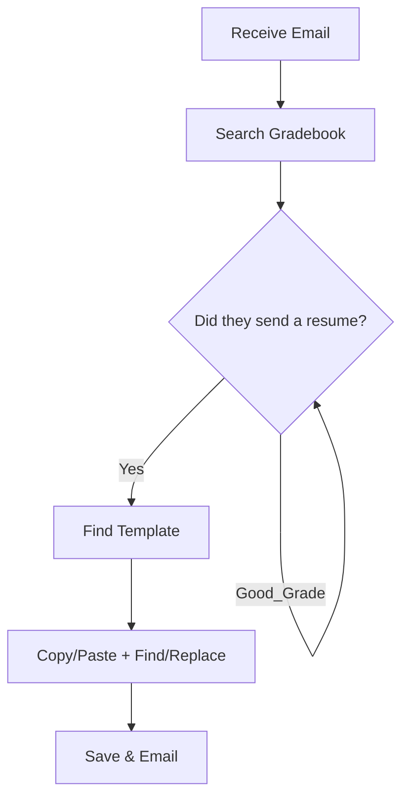

```mermaid
graph TD
    Trigger[Receive Email] --> Step1[Search Gradebook]
    Step1 --> Decision{"What did they get?"}
    Decision --Good_Grade--> Decision{"Did they send a resume?"}
    Decision --Yes--> Step2[Find Template]
    Step2 --> PainPoint[Copy/Paste + Find/Replace]
    PainPoint --> Step3[Save & Email]
```
