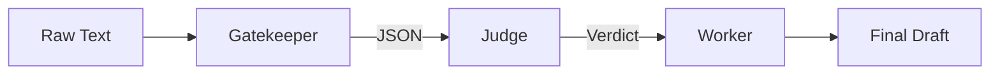

# Week 3 Assignment Instructions

**Assignment:** Milestone 2 – MVW Design & Prototyping
**Due:** Before Week 4 Live Session
**Format:** Updated PDD (Markdown/PDF)
**Weight:** 10% of Course Grade

### **The Mission: From Diagnosis to Blueprint**
In Week 2, you diagnosed the "Spaghetti" (The Manual Process). Now, you must design the **Assembly Line** (The Automated Solution).

Your goal is to design a **Linear Minimum Viable Workflow (MVW)** that replaces the manual bottleneck. You will not write Python or n8n code yet; instead, you will use **Spec-Driven Development** to prove your logic works in a manual simulation.

### **The Steps**

**1. Design the "To-Be" Architecture**
*   Take your "As-Is" Map from Week 2.
*   Create a new **Mermaid Flowchart** representing the automated "To-Be" state.
*   It must follow the **Universal Dispatcher** pattern:
    *   **Input** $\to$ **Gatekeeper** (Extraction) $\to$ **Judge** (Reasoning) $\to$ **Worker** (Drafting) $\to$ **Output**.

**2. Define the Tools (SDD)**
*   For each of the 3 nodes (Gatekeeper, Judge, Worker), fill out the **Tool Specification Canvas** in the PDD.
*   Define exactly what data comes in (Input Schema) and what comes out (Output Schema).

**2. Build the R.A.F.T. Prompts**
*   Translate your Specs into actual **System Prompts** using the R.A.F.T. framework.
*   Ensure the **Gatekeeper** outputs strict JSON.
*   Ensure the **Judge** uses `<thinking>` tags (Chain of Thought).

**4. The "Proof of Life" (Simulation)**
*   Use the `Workflow_Engine_Simulator.txt` method (or the Auto-Simulator prompt).
*   Run a real example (e.g., a real email or job description) through your chain.
*   **Paste the Chat Log** into your PDD as proof that the logic holds together.

**5. Define the ROI (KPIs)**
*   Estimate the value using the 4 Metrics (Efficiency, Quality, Cost, Satisfaction).

---

### **Grading Rubric (Milestone 2)**

| Criteria | Excellent (4 pts) | Satisfactory (2 pts) | Needs Improvement (1 pt) |
| :--- | :--- | :--- | :--- |
| **Tool Specification (SDD)** | Inputs/Outputs are rigorously defined (e.g., specific JSON keys). Failure modes (Grounding) are addressed. | Inputs/Outputs are defined but vague. Missing failure modes. | No clear specification; jumps straight to prompting. |
| **Prompt Engineering (R.A.F.T.)** | Prompts strictly follow R.A.F.T. Gatekeeper enforces JSON; Judge enforces Reasoning. No "chatty" pollution. | Prompts use R.A.F.T. but allow some "pollution" or unstructured output. | Prompts are conversational ("Please help me") rather than structural. |
| **Validation (Simulation)** | Chat log proves the chain works end-to-end on a real example. Logic is sound. | Chat log included but shows minor hallucinations or format errors. | No evidence of testing provided. |
| **Business Value (KPIs)** | At least one "Hard Metric" (Time/Cost) is quantified with realistic estimates. | Only "Soft Metrics" (Satisfaction) or vague estimates provided. | Value section missing or trivial. |

---

# Artifact 2: The Universal PDD Template (v0.2)

*Note: This template appends to the work done in Week 2. Students should keep Part 1 (The Problem) and add Part 2 (The Solution).*

```markdown
# Process Design Document (PDD) - Phase 1 Complete
**Team Name:**
**Project Title:**
**Status:** Milestone 2 (Solution Design)

---

## [Part 1: Process Analysis]
*(Leave your Week 2 work here: As-Is Map, Business Case, etc.)*

---

## Part 2: The "To-Be" Solution (Milestone 2)

### 2.1 The "To-Be" Map
*(Paste the Mermaid `graph TD` code for your Linear Assembly Line. It should look like a pipeline, not a spaghetti mess.)*



### 2.2 The Tool Specifications (SDD)
*Define the "Contract" for your 3 Guardians.*

#### **Tool A: The Gatekeeper (Extraction)**
*   **Goal:** Extract structured data from chaos.
*   **Input Variable:** `{{input_text}}` (String)
*   **Output Schema (JSON):**
    *   `key_1`: (type)
    *   `key_2`: (type)
*   **Failure Mode:** If data is missing, output `null`.

#### **Tool B: The Judge (Reasoning)**
*   **Goal:** Apply rules to the data.
*   **Input Variable:** `{{extracted_json}}`
*   **Context Rules:** (Link to your policy/rubric)
*   **Output Schema (XML):** `<thinking>` and `<verdict>`

#### **Tool C: The Worker (Drafting)**
*   **Goal:** Generate the human-facing result.
*   **Input Variable:** `{{verdict}}`
*   **Tone/Style:** (e.g., Professional, no jargon)

---

### 2.3 The R.A.F.T. Implementation
*Paste your actual System Prompts here. These are the "Code" of your workflow.*

**Prompt 1 (Gatekeeper):**
> (Paste prompt here)

**Prompt 2 (Judge):**
> (Paste prompt here)

**Prompt 3 (Worker):**
> (Paste prompt here)

---

### 2.4 "Proof of Life" (Simulation Log)
*Paste the transcript from your Manual Simulation or Auto-Simulator. Prove that Data flowed from Node 1 -> Node 2 -> Node 3 without crashing.*

> **Input:** ...
> **Node 1 Output:** ...
> **Node 2 Verdict:** ...
> **Final Output:** ...

---

### 2.5 Value Definition (The KPI Dashboard)
*How will we measure success?*

| Metric Category | Current State (As-Is) | Target State (To-Be) | Estimated Impact |
| :--- | :--- | :--- | :--- |
| **Efficiency (Time)** | e.g., 20 mins/task | 1 min/task | **95% Reduction** |
| **Quality (Error)** | e.g., 10% typo rate | 0% typo rate | **Eliminated Risk** |
| **Cost (Optional)** | e.g., $50/hr labor | $0.05 API cost | **High ROI** |

```
