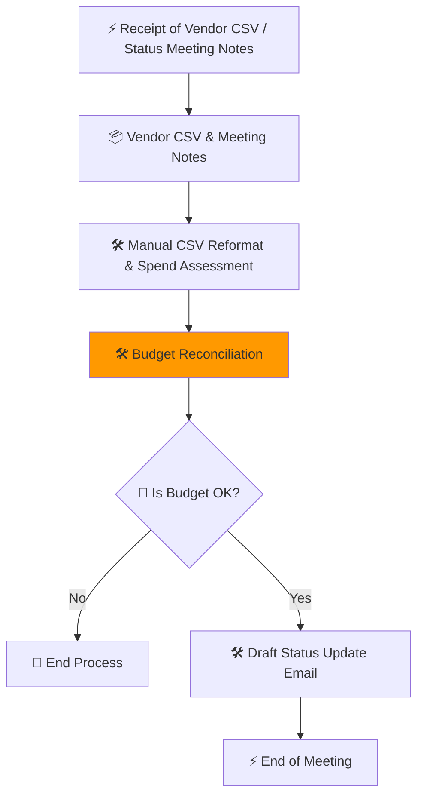

### **Artifact 1: Populated Week 2 PDD (The "Source of Truth")**
*This is the document you will "feed" to the AI in Step 2 of the video.*


# Process Definition Document (PDD) - Phase 1: Analysis
**Project Title:** Project Nova Financial Automation
**Status:** Phase 1 Complete (AS-IS Analysis)

---

## 1. Process Discovery & Mapping

### 1.1 The Scenario
The Project Nova team is currently "drowning" in manual administrative overhead. Every Friday, the Project Lead (Priya) spends 4 hours manually reconciling budget shifts. The process involves:
- Manually reformatting messy vendor CSVs.
- Cross-referencing "The Big Sheet" on SharePoint for overhead limits.
- Searching a 60-page PDF (MSA) for compliance clauses.
- Any error results in a potential $5,000 - $10,000 unauthorized spend.

### 1.2 Current Process Map (As-Is)


---

## 2. The Business Case

### 2.1 ROI Analysis Table
| Activity | Pain (1-10) | Feasibility (1-10) | Risk (1-10) | Rationale |
| :--- | :---: | :---: | :---: | :--- |
| CSV Reformatting | 9 | 8 | 7 | High repetition; Alex spends hours on data cleaning. |
| Overhead Calculation | 8 | 7 | 8 | 4+ hours weekly; high risk of miscalculating limits. |
| MSA PDF Search | 7 | 9 | 5 | Semantic search is high feasibility; saves Maria 30m/check. |
| Status Drafting | 6 | 8 | 4 | Low risk; high feasibility for LLM generation. |

### 2.2 AI Suitability Analysis
- **Unstructured Data:** The meeting transcript and 60-page MSA PDF are unstructured. Traditional code cannot parse "Priya's intent" or "Legal language" without an LLM.
- **Reasoning Complexity:** Determining if a shift over $5k triggers an MSA clause requires context-aware logic (Fuzzy Reasoning), not just a math check.

---

## 3. Solution Strategy

### 3.1 Target Zone (The MVW)
The **Minimal Viable Workflow (MVW)** will target **Step G: Budget Reconciliation**. 
- **Trigger:** Meeting Transcript notes a budget shift.
- **Goal:** Automate the logic check against the $10k limit and $5k MSA rule.

### 3.2 Business Hypothesis
> By implementing an LLM-driven automation for Project Nova’s financial reconciliation, the team will reduce weekly manual effort by 5–8 hours and mitigate human errors costing up to $10k per incident.
```

---

### **Artifact 2: The Week 3 Hands-on Artifact Checklist**

To execute the 5-step plan in the video, you need these **five specific prompt/data blocks** ready to copy-paste:

| Step | Artifact Name | Description |
| :--- | :--- | :--- |
| **1** | **The Sub-Workflow Map** | The Mermaid `graph LR` that "zooms in" on Step G. |
| **2** | **The Architect Interview Prompt** | The prompt that asks for the PDD context and interviews you for **Input/Processing/Output**. |
| **3** | **The Universal Meta-Auditor** | The QA prompt you "inject" into the chat to perform the **Unit Test Loop**. |
| **4** | **The Automated Chain Template** | The final "Super-Orchestrator" prompt that runs the verified tools end-to-end. |
| **5** | **The Metric Extraction Prompt** | The "Value Auditor" that extracts (or provides fallback) KPIs for the PDD Dashboard. |

---

### **Internal Scratch Pad (Ready for Execution)**
*   **Source of Truth:** Week 2 PDD is now grounded in the "Buffed Transcript" data (4 hours, $5k risk, $10k limit).
*   **MVW Selection:** Confirmed as **Step G** (Budget Reconciliation).
*   **Iterative Loop:** Step 3 is designed to find a flaw (e.g., the $5k MSA rule is missed) and fix it.
*   **Metric Strategy:** Step 5 includes a "Benchmark Fallback" so students always have numbers for their table.

**Does this populated PDD and the Checklist look correct? If so, I will generate the detailed prompts for Steps 1 through 5.**
