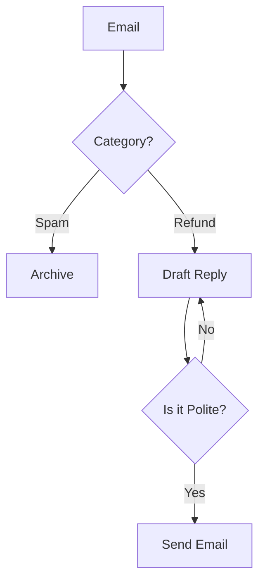

# Week 4 Cheatsheet: The System Architect's Blueprint 📐
**Theme:** From "Prompt Chains" to "Adaptive Systems"

In Week 4, we stop building straight lines. We build **Systems** that can make decisions (Routing), fix mistakes (Looping), and manage complexity (Planning).

---

### **1. The System Definition Standard (YAML-Style)**

In Week 3, we defined tools using "Pseudo-Code" to learn strictness. In Week 4, we use **YAML-Style Definitions**. This is the industry standard format for defining "Agent Capabilities" in a System Prompt.

**Template:**
```yaml
- name: [Tool Name]
  description: [One sentence explaining what it does]
  input: [What variable/data does it need?]
  output: [What specific data does it return?]
```

**Example (The Router):**
```yaml
- name: Intent_Router
  description: Analyzes the email to determine the customer's goal.
  input: Raw Email Text.
  output: One category tag: ["REFUND", "SALES", "SPAM", "OTHER"].
```

---

### **2. The Logic Patterns (The "Operating System")**

Once you have defined your tools, you must write the **Logic Block** to tell the Orchestrator how to use them.

#### **Pattern A: The Router (Conditional Branching)**
*Use this when one size does not fit all.*

```text
STEP 1: Call `Intent_Router` on the input.
STEP 2: Check the Output:
   - IF "REFUND": Call `Refund_Agent`.
   - IF "SALES": Call `Sales_Rep`.
   - IF "SPAM": Terminate workflow.
```

#### **Pattern B: The Evaluator-Optimizer (The Self-Correction Loop)**
*Use this when quality is non-negotiable (e.g., Legal/Public Comms).*

```text
STEP 1: Call `Generator_Tool` to create a Draft.
STEP 2: Call `Evaluator_Tool` to check the Draft against Policy.
   - IF Output is "PASS": Proceed to Final Output.
   - IF Output is "FAIL": 
     a. Extract the critique.
     b. Loop back to STEP 1, including the critique as context.
     c. Repeat until "PASS" (Max retries: 3).
```

---

### **3. Advanced Prompting: "The Advisor" Pattern**

Sometimes you don't want the AI to *decide*; you want it to *propose*. This is critical for Human-in-the-Loop workflows.

**The Prompt:**
> "Do not make a final decision yet. Instead, analyze the situation and propose **3 Distinct Options** for how to proceed.
> 1.  **Option A (Conservative):** Stick strictly to policy.
> 2.  **Option B (Empathetic):** Bend the rules for customer satisfaction.
> 3.  **Option C (Creative):** A unique alternative solution.
>
> For each option, list the **Pros** and **Risks**."

---

### **4. Visualizing Complexity (Mermaid for Logic)**

Drawing "Straight Lines" is easy. Drawing "Logic" requires new shapes.

| Logic Element | Mermaid Syntax | Visual Result |
| :--- | :--- | :--- |
| **The Router** (Decision) | `A --> B{Is it Spam?}` | A Diamond Shape |
| **The Branches** | `B -- Yes --> C[Archive]`<br>`B -- No --> D[Reply]` | Labeled Arrows |
| **The Loop** (Reflection) | `D --> E{Good enough?}`<br>`E -- No --> D` | An Arrow pointing back up |

**Example Code:**


---

### **5. The Master System Prompt Template**

Use this structure for your Week 4 Assignment simulation.

```markdown
# 1. Role
You are the **[System Name]** Intelligent Dispatcher. You manage a workflow of specialized tools.

# 2. Available Tools
(Paste your YAML-style tool definitions here)
- name: ...
- description: ...

# 3. The Logic
(Define your Flow Control here)
1. Ingest Data.
2. Call [Router_Tool].
3. IF [Condition A]:
   - Call [Tool A].
4. IF [Condition B]:
   - Call [Tool B].
   - Loop: Check Output with [Evaluator_Tool].

# 4. Task
I will provide an Input. You must execute the Logic step-by-step.
**Show your work** by explicitly stating which Tool you are calling and what the Output is.
```
