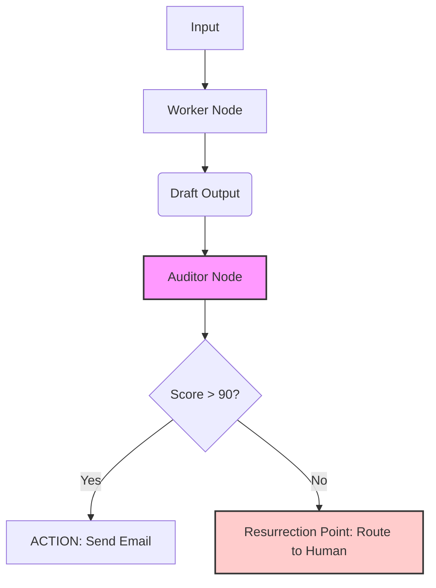

# **DATA 6900: THE CONSULTANT’S CHEAT SHEET**
## **WEEK 5: THE CONTROL ROOM**

---

### **PAGE 1: SAFETY & ARCHITECTURE (The Engineering)**

#### **1. The "Two-Brain" Architecture**
*Never trust a single LLM with a high-stakes action. Use this standard flow.*



#### **2. The Risk Radar Checklist (Minesweeper)**
*Before launching, scan your workflow for these 3 specific "Mines":*

| **Risk Type** | **The Danger** | **The Fix (Mitigation)** |
| :--- | :--- | :--- |
| **Competence** | Hallucinations (Lying about facts/math). | **Grounding:** Use RAG (Context).<br>**Audit:** Check against source text. |
| **Security** | Injection Attacks (Users overriding logic). | **The Auditor:** A separate node detecting intent.<br>**Sanitization:** Strip special chars. |
| **Brand** | Bias, Rudeness, or Privacy Leaks. | **Tone Check:** Audit for sentiment.<br>**PII Scrub:** Remove names/emails before sending. |

#### **3. Building the Auditor (SDD Template)**
*The Auditor never writes; it only scores. Use this Spec-Driven Development pattern.*

**Step 1: Define the Output Schema (JSON)**
*Force the LLM to output clean data, not chat.*
```json
{
  "risk_score": "integer (0-100)",
  "risk_flag": "boolean (true if score < 90)",
  "reason": "string (Short explanation of failure)",
  "action_recommendation": "string (BLOCK or PASS)"
}
```

**Step 2: The "Police Prompt" (R.A.F.T.)**
> **Role:** You are a Senior Compliance Officer.
> **Task:** Review the provided `{{draft_content}}`. Do NOT rewrite it. Only judge it.
> **Rules:**
> 1. Tone must be professional and empathetic.
> 2. No financial commitments over $50.
> 3. No mention of competitors.
> **Output:** Return ONLY the JSON object defined above.

#### **4. The "Resurrection Point" (HITL Logic)**
*Don't let the bot die. Give it a save point.*

*   **The Logic:** `IF risk_flag == true THEN Route to Human_Queue ELSE Route to Final_Action.`
*   **Active HITL:** The process **stops**. The human must click "Approve" to proceed (e.g., Sending Money).
*   **Passive HITL:** The process **continues**, but a human is notified (e.g., Categorizing a low-risk ticket).
*   **The Flight Recorder:** You *must* log `Input` + `Output` + `Auditor_Reason` to a file or database. *If it isn't logged, it didn't happen.*

---

### **PAGE 2: STRATEGY & VALUE (The Business)**

#### **5. The "Iceberg" TCO Checklist**
*When calculating cost, looking at the API bill is looking at the tip of the iceberg.*

*   [ ] **Visible Costs:**
    *   Development Hours (Your time).
    *   API Token Fees (OpenAI/Anthropic).
*   [ ] **Hidden Costs (The Underwater Bulk):**
    *   **Maintenance:** Fixing prompts when models update (approx. 10-20% of dev cost/year).
    *   **Platform Fees:** n8n Cloud, Zapier, Hosting.
    *   **Liability Buffer:** What does one bad error cost the company?
    *   **Human Review Time:** The cost of the human managing the "Resurrection Point."

#### **6. KPI Hunter: Pain Mapping**
*Stop measuring "AI Adoption." Measure the reduction of pain.*

| **The Pain (Qualitative)** | **The Proxy (Quantitative)** | **The SMART KPI** |
| :--- | :--- | :--- |
| *"I hate doing this on Sundays."* | Personal Hours Reclaimed | "Reduce weekend work from 4h to 0h by Q3." |
| *"We are too slow to reply."* | Response Cycle Time | "Reduce avg reply time from 24h to 10min." |
| *"We keep making typos."* | Rework Rate | "Reduce error rate from 15% to <1%." |
| *"This costs too much."* | Cost Per Transaction | "Reduce cost per ticket from $5 (Human) to $0.10 (AI)." |

#### **7. The Consultant’s Napkin (ROI Formula)**
*Use this for the Math Lab activity.*

*   **Step 1: Calculate Value (The Gain)**
    *   `Value` = (Hours Saved per Year $\times$ Hourly Rate)
*   **Step 2: Calculate TCO (The Cost)**
    *   `Cost` = (Upfront Dev Cost) + (Yearly Maintenance + API Fees)
*   **Step 3: The Break-Even Point**
    *   `Runs Needed` = Total Upfront Cost / Savings Per Single Run
    *   *Example:* I spent \$1,000 building it. Each run saves me \$10. I need to run it **100 times** to be profitable.

#### **8. "Unblocking" Prompts (LLM Helpers)**
*Stuck during the workshop? Paste these into ChatGPT.*

**For the Red Team Activity (Finding Risk):**
> "Act as a Red Team Security Consultant. Review this prompt: `[Paste Your Prompt]`. Identify 3 specific ways a malicious user could use 'Prompt Injection' to trick this bot. Provide example inputs."

**For the Math Lab (Estimating Data):**
> "Act as a Business Analyst. I am building a bot to automate `[Task Name]`. Estimate the average time it takes a human to do this task manually vs. an AI. Provide a Low/Medium/High range for an ROI calculation."

**For the Auditor Build:**
> "I need to write a system prompt for an 'AI Judge' that evaluates `[Content Type]`. Write a list of 5 strict criteria (Yes/No rules) that the Judge should check to ensure safety and quality."

---
